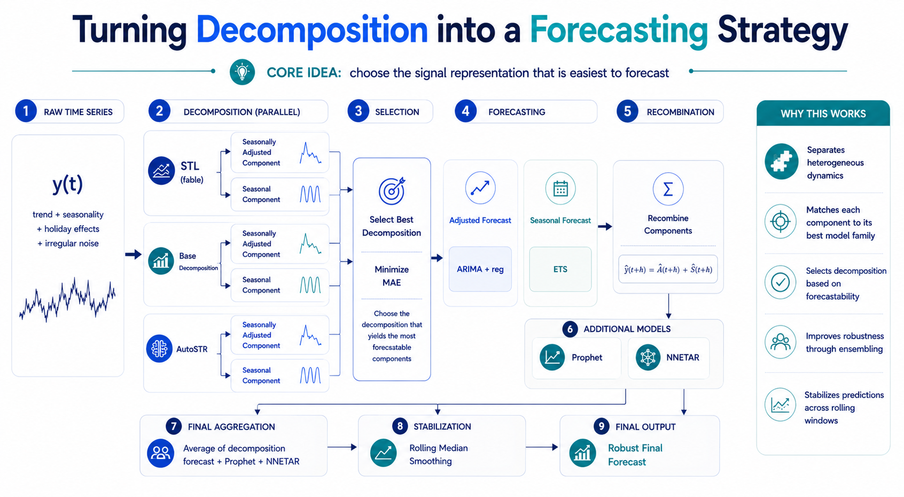

# Turning Decomposition into a Forecasting Strategy

A decomposition-first forecasting framework for weekly time series, based on adaptive decomposition selection, component-wise modeling, and robust ensemble aggregation.

---

## 🌐 Project Website

Visit the full project page here:

👉 **[Project Site](https://ningistine7.github.io/turning-decomposition-into-a-forecasting-strategy/)**

---

## Overview

This project documents a forecasting architecture designed for weekly time series with overlapping trend, seasonality, holiday effects, and irregular noise.

The key idea is to treat **decomposition as a forecasting strategy** rather than as a simple preprocessing step.

---

## Core Approach

- Generate multiple decompositions of the same series
- Split each decomposition into adjusted and seasonal components
- Select the decomposition with the lowest combined residual error
- Forecast each component with a specialized model family
- Recombine and aggregate with complementary models
- Stabilize the final output with rolling median smoothing

---

## Methods Used

- **STL**
- **STL + classical decomposition**
- **AutoSTR**
- **ARIMA** with exogenous regressors
- **ETS**
- **Prophet**
- **NNETAR**

---

## Results

- **Mean WMAPE (12-week sum):** ~4.2%
- **Max WMAPE:** ~8.3%
- **Mean WMAPE (per week):** ~11.1%

---

## Public Scope

This repository is a public showcase of the methodology, architecture, and selected implementation logic.  
It does not include full production code or private data.

---

## Architecture



<details>
<summary>📋 View detailed text-based architecture diagram</summary>

```text
                        ┌─────────────────┐
                        │  Raw Time Series │
                        │      y(t)        │
                        └────────┬─────────┘
                                 │
              ┌──────────────────┼──────────────────┐
              ▼                  ▼                   ▼
    ┌─────────────────┐ ┌─────────────────┐ ┌─────────────────┐
    │  STL (fable)    │ │ STL+Decompose   │ │    AutoSTR      │
    │  window=53      │ │ (stats)         │ │  (regularized)  │
    └───────┬─────────┘ └───────┬─────────┘ └───────┬─────────┘
            │                   │                    │
            ▼                   ▼                    ▼
    ┌─────────────┐     ┌─────────────┐     ┌─────────────┐
    │ Adjusted(t) │     │ Adjusted(t) │     │ Adjusted(t) │
    │ Seasonal(t) │     │ Seasonal(t) │     │ Seasonal(t) │
    └──────┬──────┘     └──────┬──────┘     └──────┬──────┘
           │                   │                    │
           └───────────────────┼────────────────────┘
                               │
                               ▼
                  ┌─────────────────────────┐
                  │  SELECT BEST by MAE     │
                  │  (adj_residual +        │
                  │   seasonal_residual)    │
                  └────────────┬────────────┘
                               │
              ┌────────────────┼────────────────┐
              ▼                                  ▼
    ┌──────────────────┐              ┌──────────────────┐
    │ Forecast Adjusted│              │ Forecast Seasonal│
    │ ARIMA(0,1,2)     │              │ ETS(A,A,N)       │
    │ ARIMA(0,2,2)     │              │ trend_window=30  │
    │ [50/50 mixture]  │              │ [weight=1.0]     │
    └────────┬─────────┘              └────────┬─────────┘
             │                                  │
             └──────────────┬───────────────────┘
                            │
                            ▼
              ┌──────────────────────────┐
              │  Â(t+h) + Ŝ(t+h)        │
              └────────────┬─────────────┘
                           │
          ┌────────────────┼────────────────┐
          ▼                ▼                 ▼
  ┌──────────────┐ ┌─────────────┐ ┌──────────────┐
  │   Decomp     │ │  Prophet    │ │   NNETAR     │
  │  Ensemble    │ │ (on maxes)  │ │ (with xreg)  │
  └──────┬───────┘ └──────┬──────┘ └──────┬───────┘
         │                 │                │
         └─────────────────┼────────────────┘
                           │
                           ▼
                  ┌─────────────────┐
                  │  Average / 3    │
                  └────────┬────────┘
                           │
                           ▼
                  ┌─────────────────┐
                  │ Rolling Median  │
                  │  (smoothing)    │
                  └────────┬────────┘
                           │
                           ▼
                  ┌─────────────────┐
                  │ FINAL FORECAST  │
                  │  ŷ(t+h)        │
                  └─────────────────┘

